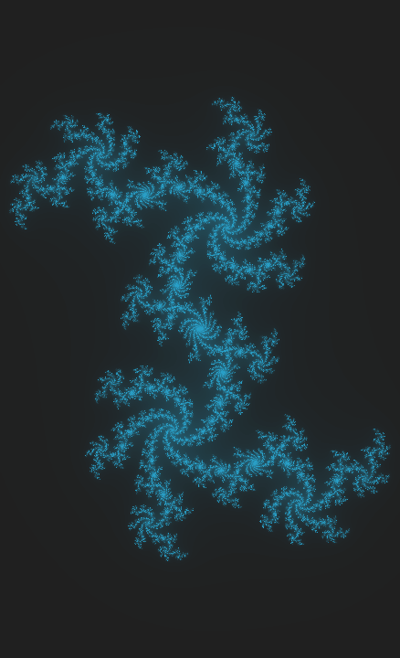
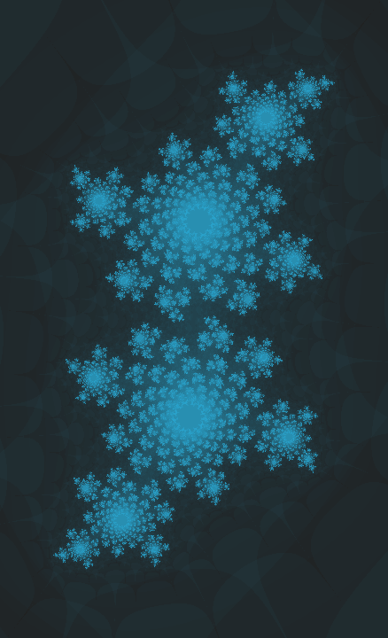
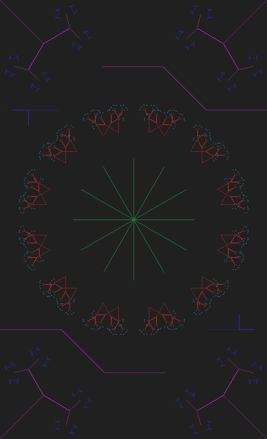

# Fractal Shape Creation
This is an open, free repository used to store fractal shapes.
### JULIA-2026082101
```
Canvas Size = 438x720
Canvas Scale = 1:4
Constant C = 0.3755-0.3697i
```

### JULIA-2026090101
```
Canvas Size = 438x720
Canvas Scale = 1:1
Constant C = 0.3755-0.3697i
```

### JULIA-2026091001
```
Canvas Size = 438x720
Canvas Scale = 1:1
Constant C = -0.4+0.6i
```

### JULIA_TUNED-2026090901
```
Canvas Size = 438x720
Canvas Scale = 1:1
Constant C = -0.4+0.6i
```

### L_SYSTEM-2026062601

### L_SYSTEM-2026090101

