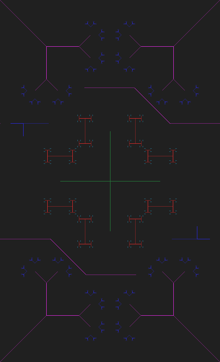
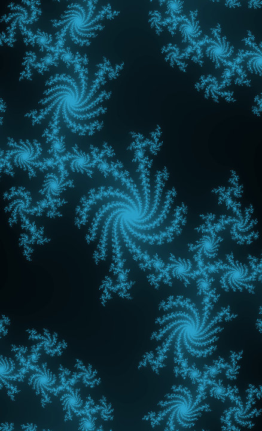

# Fractal Shape Creation
This is an open, free repository used to store fractal shapes.
### L_SYSTEM-2026062601

### JULIA-2026082101
Canvas Size = 438x720
Canvas Scale = 1:4
Constant C = 0.3755-0.3697i

